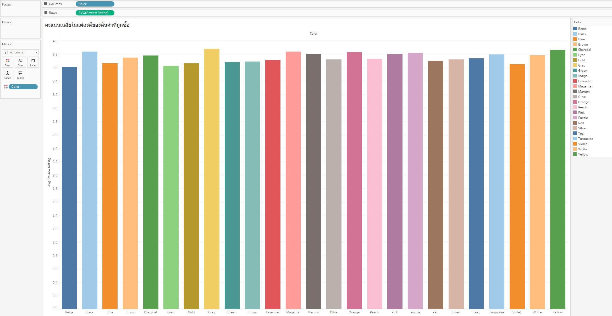
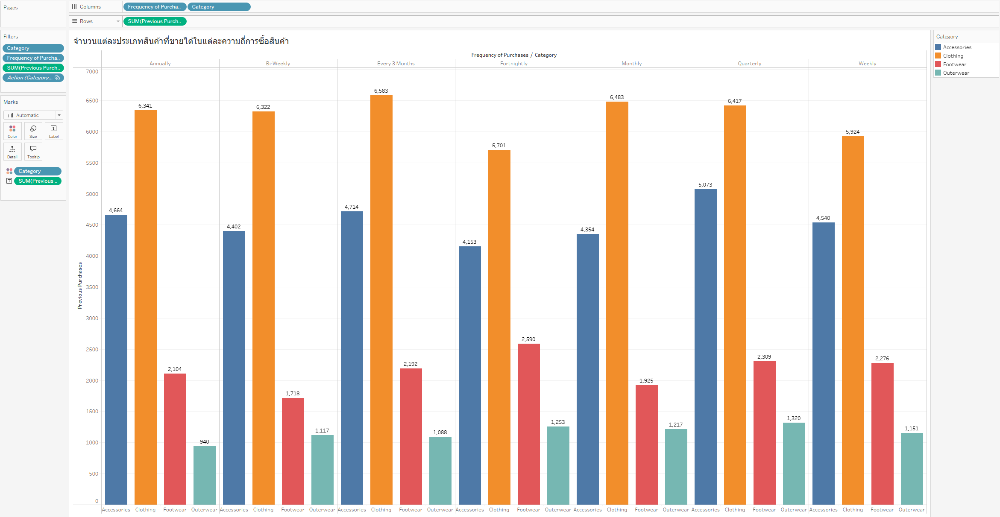
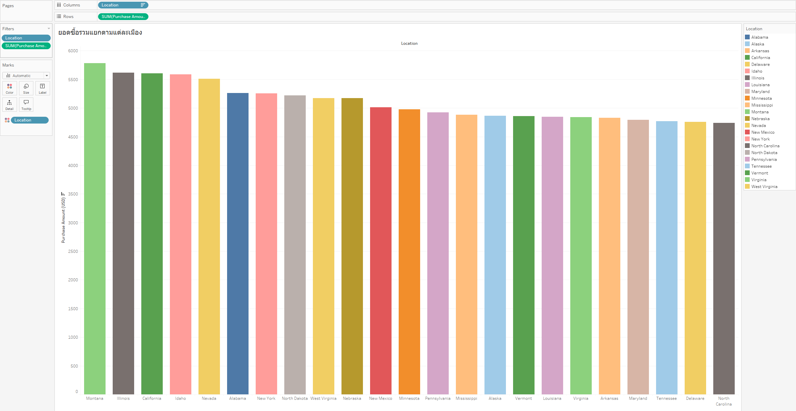
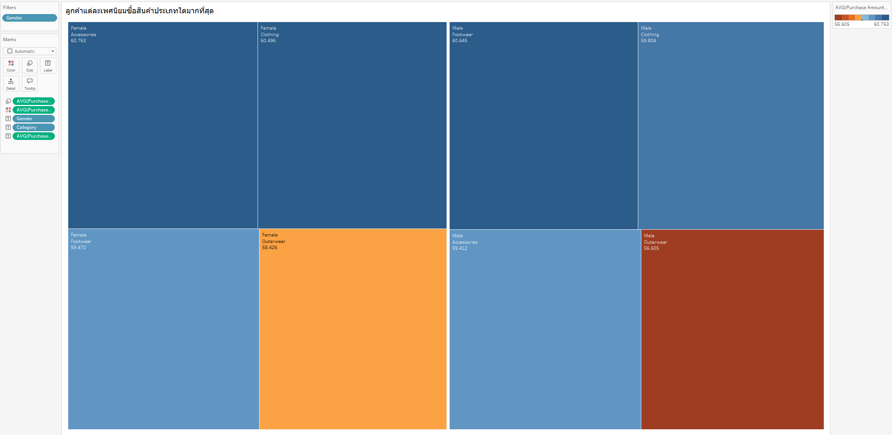
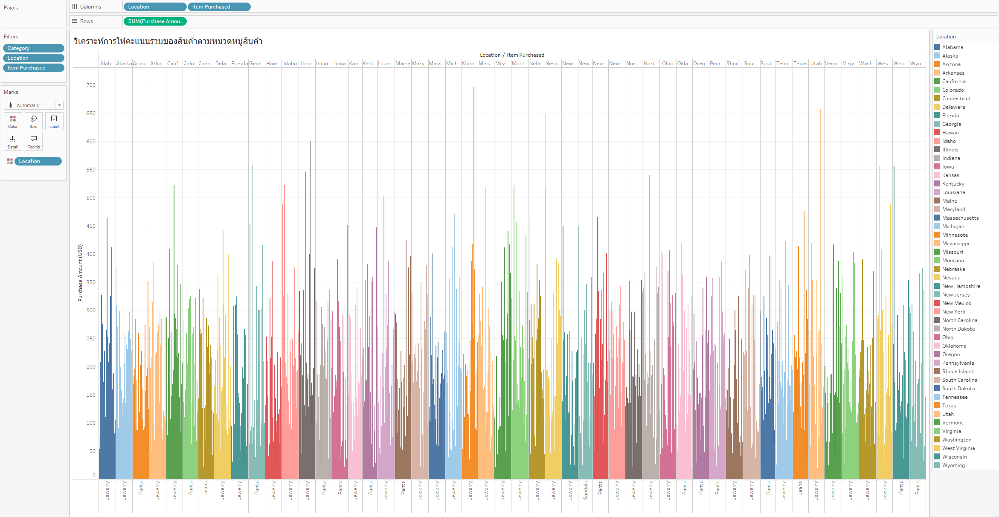
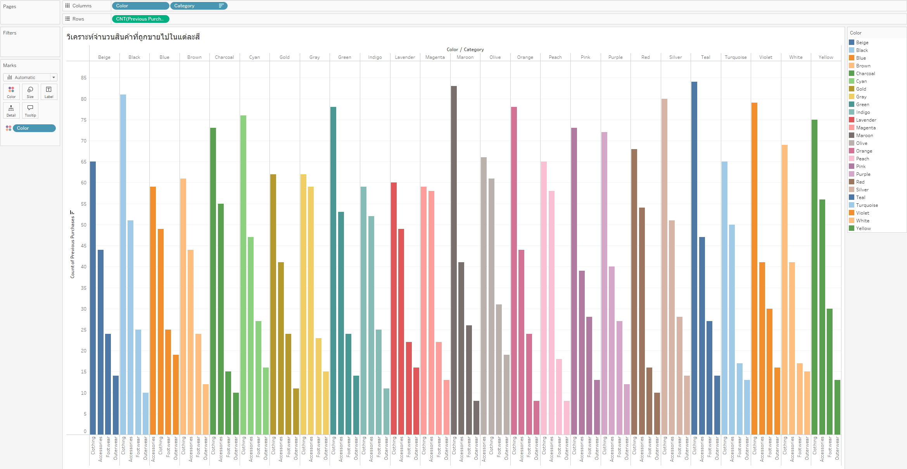
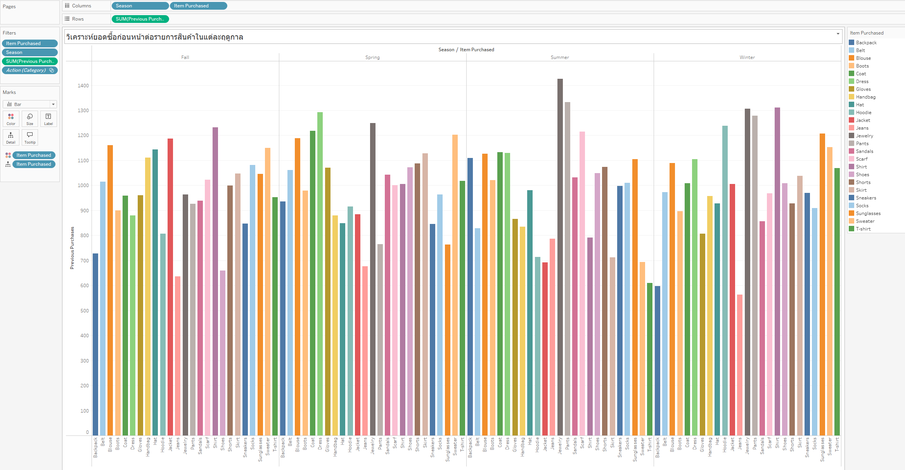
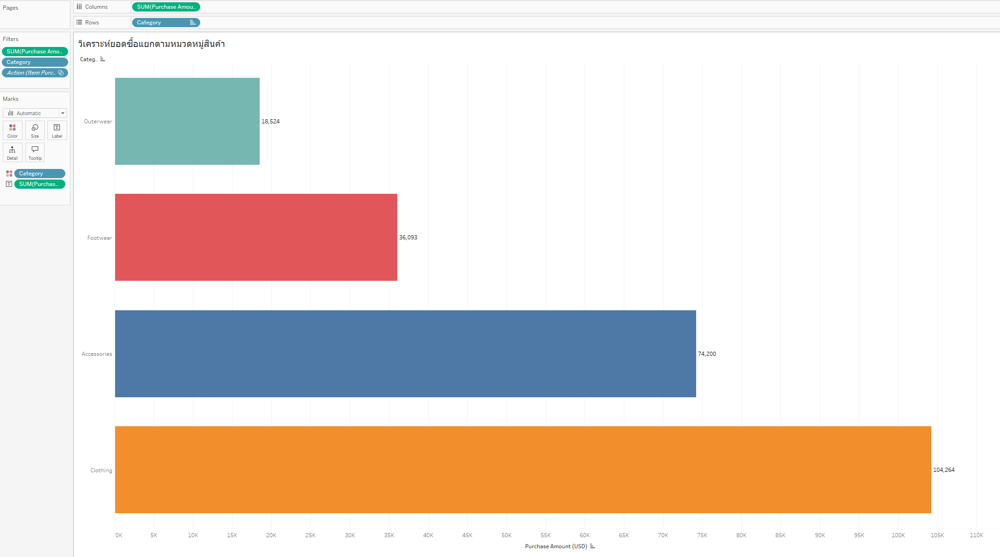
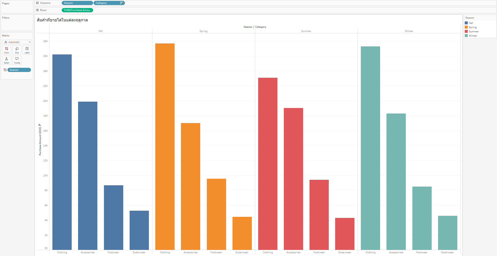

# CP372-TPPS
This projest was created for the final project in CP372: Data Analytics and Business Intelligence.

## Project Overview
This project focuses on analyzing the "Customer Shopping Trends Dataset" from Kaggle to understand customer purchasing behaviors and trends.  The primary objective is to prepare and enrich this dataset through a comprehensive process of data cleaning, transformation, and feature engineering.

The initial phase, detailed in the CP372_FinalProject_115_122.ipynb notebook, involves:
* Importing and inspecting the raw dataset.
* Handling any missing or duplicate data to ensure data quality.
* Engineering new, insightful features to enhance analytical value, including:

  * Age Group
  * Price Category
  * Discount Flag (Has Discount)
  * Profit Margin (30% of purchase amount)
  * Loyalty Score (based on previous purchases and subscription status)
  * Average Spending per customer
 
The outcome of this data preparation phase is a cleaned and feature-enriched dataset (`shopping_trends_feature_engineered.csv`). This refined dataset is designed to be readily usable for subsequent in-depth exploratory data analysis, data visualization (e.g., using Tableau as outlined in the project canvas), and to serve as a solid foundation for potential machine learning modeling tasks.  Ultimately, the insights derived from analyzing this prepared data aim to help businesses make more informed decisions, tailor marketing strategies, and identify key customer segments and purchasing patterns. 

## Getting Started
This section outlines the steps to set up the environment, download the dataset, and run the data processing notebook.
Prerequisites:
* Python 3.x
* Jupyter Notebook environment (e.g., Google Colab, local JupyterLab or Jupyter Notebook installation)
* The following Python libraries:
    * pandas
    * numpy
    * kagglehub
 
You can typically install these libraries using pip :          
``` 
Bash  pip install pandas numpy kagglehub
```

### 1. Set up Kaggle API (if running locally)

To download datasets from Kaggle using the `kagglehub` library, you might need to have your Kaggle API token set up:
* Go to your Kaggle account settings, find the "API" section, and click "Create New Token". This will download a `kaggle.json` file.

  
* Place this `kaggle.json` file in the expected directory (e.g., `~/.kaggle/` on Linux/macOS or `C:\Users\<Your-Username>\.kaggle\` on Windows).


(If you are using Google Colab, you might need to upload your `kaggle.json` file and configure its path for Kaggle's services to work, or use Colab's built-in Kaggle integration.)

### 2. Obtain the Notebook

Clone this repository or download the `CP372_FinalProject_115_122.ipynb` file.

### 3. Download the Dataset

The notebook is set up to download the "Customer Shopping Trends Dataset" directly from Kaggle using the `kagglehub` library. The relevant code in the notebook is:
```Python

import kagglehub

#Download latest version

path = kagglehub.dataset_download("iamsouravbanerjee/customer-shopping-trends-dataset") #

print("Path to dataset files:", path) #
```


When you run this cell in the notebook, it will download the dataset files. The original dataset file used is `shopping_trends.csv`.

### 4. Run the Jupyter Notebook (`CP372_FinalProject_115_122.ipynb`)

* Open the `CP372_FinalProject_115_122.ipynb` notebook in your Jupyter environment.
* Execute the cells sequentially.

The notebook will perform the following key steps:

* Import necessary libraries.
* Download the "Customer Shopping Trends Dataset".
* Load the data into a pandas DataFrame.
* Inspect the data (checking shape, columns, info, missing values, duplicates).
* Perform feature engineering to create new columns such as 'Age Group', 'Price Category', 'Has Discount', 'Profit Margin (USD)', 'Loyalty Score', and 'AVG Spending'.
* Save the processed and feature-engineered DataFrame to a new CSV file named `shopping_trends_feature_engineered.csv`.

### 5. Output

After running the notebook, you will find the processed dataset:

* `shopping_trends_feature_engineered.csv`: This file contains the original data along with the newly engineered features, ready for further analysis.
You can then use this cleaned dataset for your analyses, visualizations (e.g., in Tableau), or machine learning tasks as outlined in your project canvas.


## Exploratory Data Analysis (EDA)
The initial phase of this project focused on exploratory data analysis to understand customer shopping behaviors and identify key trends within the "Customer Shopping Trends Dataset". The analysis involved data cleaning, transformation, and feature engineering to prepare the dataset for meaningful insights.


















>Seasonal Product Sales by Category
### Exploratory Data Analysis: Seasonal Product Sales by Category
This visualization illustrates the total Purchase Amount for different product Categories during each Season (Fall, Spring, Summer, Winter). Understanding these seasonal patterns is crucial for inventory management, marketing campaigns, and sales forecasting.

Visualization Type: Bar Chart (grouped by Season, with bars representing Categories within each season).

#### Axes:

**X-axis:** Season (Categorical: Fall, Spring, Summer, Winter) and within each season, Category (Categorical: Clothing, Accessories, Footwear, Outerwear).

**Y-axis:** SUM(Purchase Amount) (Numerical: Total purchase amount in USD, ranging up to approximately 28,000 USD).
#### Key Observations:

* **Dominant Categories Across Seasons:** Clothing consistently generates the highest purchase amounts in almost all seasons. Accessories also show strong sales across most seasons.
* **Seasonal Peaks for Specific Categories:**

  * **Fall:** Clothing has the highest sales, followed by Accessories. Outerwear sales are moderate, likely due to the onset of cooler weather.
  * **Spring:** Clothing sales are strong, but Accessories also show a significant boost compared to Fall. Footwear sales are moderate.
  * **Summer:** Clothing remains dominant. Accessories also maintain high sales. Footwear sales are notably lower than in Spring, which might be counterintuitive and warrants further investigation (e.g., specific types of footwear). Outerwear sales are the lowest, as expected.
  * **Winter:** Clothing sales peak dramatically, suggesting a high demand for winter apparel. Accessories also perform very well. Outerwear sales experience their highest peak in Winter, which is highly expected. Footwear sales are moderate.

* **Lowest Performing Category:** Outerwear generally has the lowest sales in Spring and Summer, as expected, but experiences a significant surge in Fall and especially Winter. Footwear also tends to be lower compared to Clothing and Accessories.
* **Strategic Insights:**
  * **Inventory Planning:** Businesses can use this data to optimize inventory levels for each category based on the season. For example, stocking up on Outerwear for Winter and reducing it for Summer.
  * **Marketing & Promotions:** Tailor marketing campaigns to highlight relevant categories during specific seasons (e.g., promoting Clothing and Outerwear heavily in Winter).
  * **Product Development:** Identify opportunities for new products or variations within categories that show lower sales in certain seasons (e.g., lightweight footwear for summer).


**How to Interpret:** Each group of bars represents a Season. Within each season, individual bars represent the total Purchase Amount for a specific Category. The color of the bars also indicates the Season, providing an additional visual cue.


**Group Members :**

          แทนทอง   เปล่งเสียง    65102010115
          พัชรพล    เสริมแก้ว     65102010122
